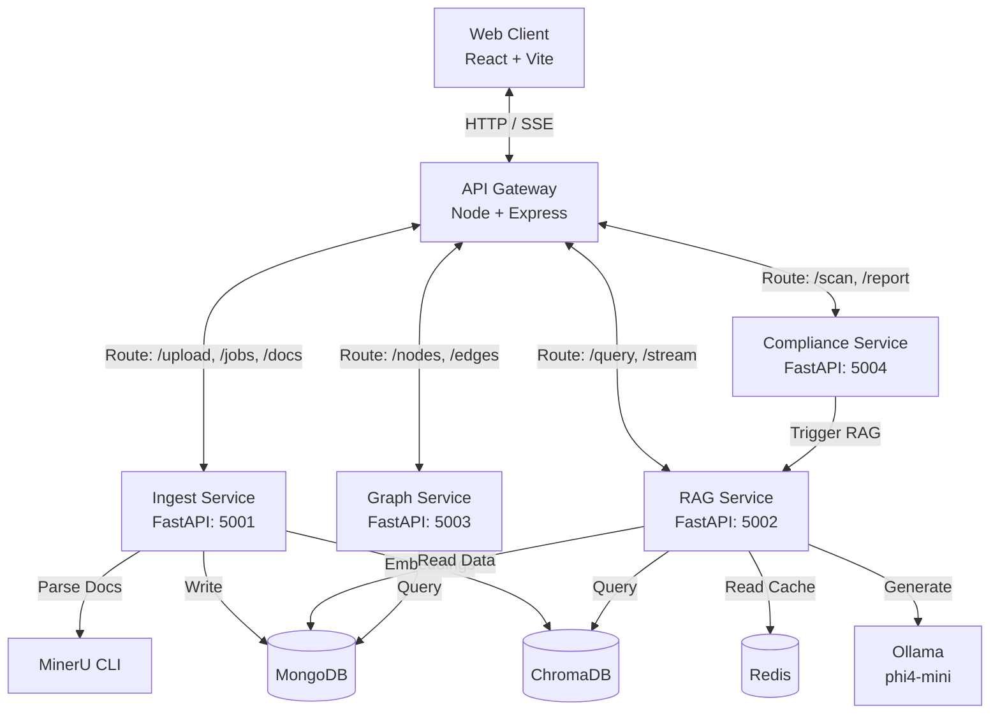

<div align="center">

# ⬡ Elixara

**The Industrial Knowledge Intelligence Platform**

*Ask questions. Get cited answers. Prevent failures. All from your plant's collective knowledge.*

[](https://opensource.org/licenses/MIT)
[](#)
[](#)
[](#)

</div>

<br/>

Elixara is a **CPU-Only, Zero Cloud Cost** industrial intelligence platform designed for **Problem Statement 8** of the ET AI Hackathon 2.0. It ingests complex industrial documents (P&IDs, maintenance logs, regulatory standards) and provides engineers with an intelligent copilot that answers operational queries with cited sources, visualizes entity relationships via a Knowledge Graph, and automates compliance audits.

---

## 📑 Table of Contents

- [✨ Features](#-features)
- [🏗️ System Architecture](#️-system-architecture)
- [🛠️ Technology Stack](#️-technology-stack)
- [📦 Project Structure](#-project-structure)
- [🚀 Quick Start Guide](#-quick-start-guide)
  - [Prerequisites](#prerequisites)
  - [Installation & Setup](#installation--setup)
- [📡 Services & Ports](#-services--ports)
- [🤝 Contributing](#-contributing)
- [📄 License](#-license)

---

## ✨ Features

- **Hybrid RAG Pipeline**: Combines dense vector search (ChromaDB + `nomic-embed-text`) with sparse retrieval (BM25) using **Reciprocal Rank Fusion (RRF)** for unparalleled accuracy.
- **Cross-Encoder Reranking**: Uses `ms-marco-MiniLM-L-6-v2` locally to accurately rank contexts before feeding them to the LLM.
- **Local LLM Generation**: Fully offline text generation powered by **phi4-mini 3.8B** via Ollama, streaming responses back in real-time via Server-Sent Events (SSE).
- **Automated Compliance Auditing**: Cross-references internal procedures against Indian industrial standards (OISD, PESO, Factories Act) and generates detailed gap analysis reports.
- **Knowledge Graph Explorer**: Interactive D3.js powered visualizations of extracted entities and relationships across all ingested documents.
- **Intelligent Ingestion**: Leverages **MinerU** (86.2 OmniDocBench score) for superior PDF and layout parsing without requiring GPUs.
- **Blazing Fast Cache**: Integrates Redis for sub-50ms cache hits on recurring queries.

---

## 🏗️ System Architecture

Elixara operates on a robust microservices architecture, orchestrated via a Node.js API Gateway, communicating with 4 specialized Python services.



---

## 🛠️ Technology Stack

| Component | Technology | Description |
| :--- | :--- | :--- |
| **Document Parsing** | `MinerU` | Pipeline backend scoring 86.2 on OmniDocBench v1.5 |
| **Large Language Model** | `Ollama` / `phi4-mini` | 3.8B parameter local model for highly accurate, offline generation |
| **Embeddings** | `nomic-embed-text` | 137M parameter model for dense vector representation |
| **Vector Database** | `ChromaDB` | Embedded vector database with cosine similarity search |
| **Sparse Retrieval** | `BM25Okapi` | Traditional keyword-based retrieval via `rank-bm25` |
| **Reranker** | `MiniLM-L-6-v2` | Lightweight (22MB) CPU-bound cross-encoder |
| **Primary Database** | `MongoDB 7` | Stores parsed document metadata, entities, and query history |
| **Cache Layer** | `Redis 7` | Accelerates recurring query retrieval |
| **API Gateway** | `Node.js` + `Express` | Centralized routing, authentication, and error handling |
| **Frontend UI** | `React 18` + `Vite` | Styled with TailwindCSS, dynamic charts via Recharts & D3 |

---

## 📦 Project Structure

```text
elixara/
├── frontend/             # React SPA (Vite, Zustand, Tailwind, D3)
├── gateway/              # Node.js API Proxy & Auth Middleware
├── services/             # Python Microservices (FastAPI)
│   ├── ingest_service/   # MinerU parsing, chunking, NER extraction
│   ├── rag_service/      # Hybrid retrieval, RRF, Reranking, SSE Streaming
│   ├── graph_service/    # Knowledge Graph CRUD and BFS pathfinding
│   ├── compliance_service/# Regulatory audits against OISD/PESO
│   └── shared/           # Shared models, DB connections, configs
├── scripts/              # Setup, health checks, and demo seed scripts
└── .env.example          # Environment variable template
```

---

## 🚀 Quick Start Guide

### Prerequisites

Ensure the following runtimes and databases are installed and actively running on your machine:

- **Node.js**: v20 LTS or higher
- **Python**: v3.11
- **MongoDB**: v7.0+ *(Running on port 27017)*
- **Redis**: v7.0+ *(Running on port 6379)*
- **Ollama**: *(Running on port 11434)*

### Installation & Setup (5 Steps)

#### Step 1: Pull Local AI Models
Download the required LLM and embedding models via Ollama. This is a one-time operation (~2.7GB).
```bash
ollama pull phi4-mini
ollama pull nomic-embed-text
```

#### Step 2: Install MinerU Parser
Set up an isolated environment for MinerU and download the required parsing models (~1.5GB).
```bash
python3.11 -m venv ~/.mineru_env
source ~/.mineru_env/bin/activate
pip install "mineru[core]"
CUDA_VISIBLE_DEVICES="" python -c "from mineru.utils.download import download_model; download_model('pipeline')"
deactivate
```
> **Important:** Add MinerU to your system PATH (e.g., in `~/.bashrc` or `~/.zshrc`):
> `export PATH="$HOME/.mineru_env/bin:$PATH"`

#### Step 3: Configure Environment Variables
Copy the provided template to establish your local configuration. The defaults are optimized for local development out-of-the-box.
```bash
cp .env.example .env
```

#### Step 4: Install Dependencies
Install packages for the Node.js layers and create virtual environments for the Python microservices.
```bash
# 1. Install Node dependencies (Root, Frontend, Gateway)
npm install
cd frontend && npm install && cd ..
cd gateway && npm install && cd ..

# 2. Install Python dependencies across services
for svc in ingest_service rag_service graph_service compliance_service; do
  cd services/$svc
  python3.11 -m venv .venv
  
  # Note: Install CPU-only Torch explicitly for the RAG service
  if [ "$svc" = "rag_service" ]; then
    .venv/bin/pip install torch==2.3.1+cpu --index-url https://download.pytorch.org/whl/cpu
  fi
  
  .venv/bin/pip install -r requirements.txt
  cd ../..
done
```

#### Step 5: Launch Elixara
Start all services simultaneously.
```bash
npm run dev:all
```

**Access the application at:** `http://localhost:5173`
**Demo Login:** `demo` / `elixara2024`

*(Optional)* Seed demo data to populate your environment immediately:
```bash
python scripts/seed_demo.py
```

---

## 📡 Services & Ports

| Component | Framework | Port | Access URL |
| :--- | :--- | :--- | :--- |
| **Frontend App** | React/Vite | `5173` | `http://localhost:5173` |
| **API Gateway** | Express | `4000` | `http://localhost:4000/api/*` |
| **Ingest Service** | FastAPI | `5001` | `http://localhost:5001/docs` |
| **RAG Service** | FastAPI | `5002` | `http://localhost:5002/docs` |
| **Graph Service** | FastAPI | `5003` | `http://localhost:5003/docs` |
| **Compliance Service** | FastAPI | `5004` | `http://localhost:5004/docs` |

You can quickly verify that all microservices are healthy by running:
```bash
python scripts/check_health.py
```

---

## 🤝 Contributing

This project was built for the **ET AI Hackathon 2.0**. While it operates as a proof-of-concept, we welcome pull requests for performance optimizations, additional standard templates, and UX improvements.

1. Fork the repository
2. Create your feature branch (`git checkout -b feature/AmazingFeature`)
3. Commit your changes (`git commit -m 'Add some AmazingFeature'`)
4. Push to the branch (`git push origin feature/AmazingFeature`)
5. Open a Pull Request

---

## 📄 License

Distributed under the MIT License. See `LICENSE` for more information.

<br/>
<div align="center">
  <i>Built with precision for the industrial engineers of tomorrow.</i>
</div>
