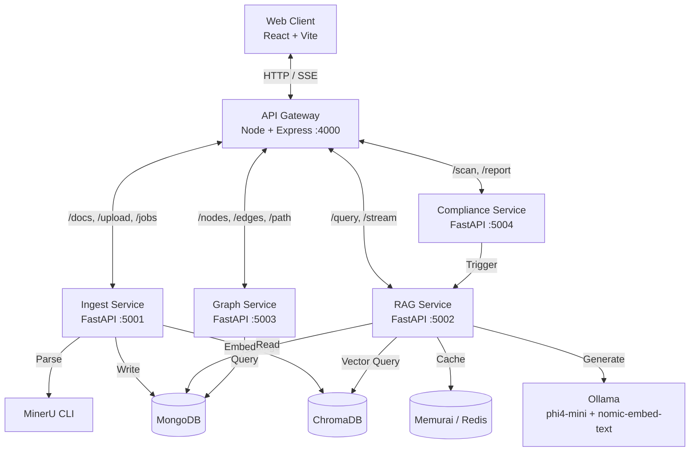

<div align="center">

# ⬡ Elixara

**The Industrial Knowledge Intelligence Platform**

*Ask questions. Get cited answers. Prevent failures. All from your plant's collective knowledge.*

[](https://opensource.org/licenses/MIT)
[](#)
[](#)
[](#)
[](#)

</div>

<br/>

Elixara is a **CPU-only, zero cloud cost** industrial intelligence platform built for **Problem Statement 8** of the ET AI Hackathon 2.0. It ingests industrial documents (manuals, inspection reports, regulatory standards, work orders), and gives engineers an AI copilot that answers operational questions with cited sources, visualizes entity relationships as a live knowledge graph, and automates regulatory compliance checks.

> **This README is written specifically for Windows + PowerShell.** Every command below has been verified to work in a native Windows environment — no WSL, no Git Bash required.

---

## 📑 Table of Contents

- [✨ Features](#-features)
- [🏗️ System Architecture](#️-system-architecture)
- [🛠️ Technology Stack](#️-technology-stack)
- [📦 Project Structure](#-project-structure)
- [✅ Prerequisites](#-prerequisites)
- [🚀 Setup Guide (Windows / PowerShell)](#-setup-guide-windows--powershell)
- [▶️ Running Elixara](#️-running-elixara)
- [📡 Services & Ports](#-services--ports)
- [🩺 Health Check](#-health-check)
- [🔧 Troubleshooting (Windows-specific)](#-troubleshooting-windows-specific)
- [📄 License](#-license)

---

## ✨ Features

- **Hybrid RAG Pipeline** — dense vector search (ChromaDB + `nomic-embed-text`) combined with sparse retrieval (BM25) via **Reciprocal Rank Fusion (RRF)**.
- **Cross-Encoder Reranking** — `ms-marco-MiniLM-L-6-v2` reranks candidates locally before they reach the LLM.
- **Local LLM Generation** — fully offline answers via **phi4-mini (3.8B)** through Ollama, streamed token-by-token over Server-Sent Events.
- **Automated Compliance Auditing** — cross-references your documents against OISD, PESO, and Factories Act requirements, and generates a gap report.
- **Knowledge Graph Explorer** — interactive D3.js visualization of every entity and relationship extracted from your documents.
- **Intelligent Ingestion** — MinerU (86.2 OmniDocBench score) parses PDFs, tables, and layouts without needing a GPU.
- **Sub-50ms Cache** — Redis-compatible caching (via Memurai on Windows) for repeated queries.

---

## 🏗️ System Architecture



---

## 🛠️ Technology Stack

| Component | Technology | Notes |
| :--- | :--- | :--- |
| Document Parsing | `MinerU` | CPU pipeline backend, 86.2 OmniDocBench v1.5 |
| LLM | `Ollama` / `phi4-mini` | 3.8B params, local, streaming |
| Embeddings | `nomic-embed-text` | 137M params, 768-dim |
| Vector DB | `ChromaDB` | Embedded mode — no separate server |
| Sparse Retrieval | `BM25Okapi` (`rank-bm25`) | Keyword-based fallback for dense search |
| Reranker | `ms-marco-MiniLM-L-6-v2` | 22MB cross-encoder |
| Primary DB | `MongoDB 7` | Windows Service |
| Cache | `Memurai` (Redis-compatible) | Windows Service |
| Gateway | `Node.js` + `Express` | Auth, uploads, SSE proxy |
| Frontend | `React 18` + `Vite` | Tailwind, Zustand, D3, Recharts |

---

## 📦 Project Structure

```text
elixara/
├── frontend/              React SPA (Vite, Zustand, Tailwind, D3)
├── gateway/                Node.js API proxy + JWT auth
├── services/                Python microservices (FastAPI)
│   ├── ingest_service/       MinerU parsing, chunking, NER extraction   :5001
│   ├── rag_service/           Hybrid retrieval, reranking, SSE stream   :5002
│   ├── graph_service/         Knowledge graph CRUD + BFS pathfinder     :5003
│   ├── compliance_service/    Regulatory gap scanning                  :5004
│   └── shared/                Shared config, DB clients, models
├── scripts/                 Setup, health check, demo seed scripts
├── demo_docs/               Sample industrial PDFs for the hackathon demo
├── .env.example              Environment variable template
└── package.json               Root dev orchestration (Windows-adapted)
```

---

## ✅ Prerequisites

Install these **before** touching the project folder. Each one runs as a background Windows Service once installed, so you won't need to manually start them every time.

| Tool | Purpose | Download | Verify with |
| :--- | :--- | :--- | :--- |
| **Node.js 20+** | Frontend + Gateway | [nodejs.org](https://nodejs.org) | `node --version` |
| **Python 3.11** | AI microservices | [python.org](https://python.org) | `python --version` |
| **Git** | Version control | [git-scm.com](https://git-scm.com) | `git --version` |
| **MongoDB Community** | Primary database | [mongodb.com/try/download/community](https://www.mongodb.com/try/download/community) — choose **msi**, keep "Install as a Service" checked | `mongosh --version` |
| **Memurai (Developer Edition)** | Redis-compatible cache | [memurai.com/get-memurai](https://www.memurai.com/get-memurai) | `memurai-cli ping` → `PONG` |
| **Ollama** | Local LLM runtime | [ollama.com](https://ollama.com) | `ollama list` |

Pull the two required models one time (~2.7GB total):

```powershell
ollama pull phi4-mini
ollama pull nomic-embed-text
```

---

## 🚀 Setup Guide (Windows / PowerShell)

All commands assume you're in the `elixara\` project root inside a PowerShell terminal (VS Code's integrated terminal works great).

### Step 1 — Install MinerU (its own isolated environment)

MinerU has heavy dependencies, so it gets its own virtual environment outside the project folder:

```powershell
python -m venv $HOME\.mineru_env
$HOME\.mineru_env\Scripts\Activate.ps1

pip install "mineru[core]"

# Downloads ~1.5GB of parsing models, one-time only
python -c "from mineru.utils.download import download_model; download_model('pipeline')"

deactivate
```

Add MinerU to your permanent PATH so it can be called from anywhere:

```powershell
[Environment]::SetEnvironmentVariable("Path", $env:Path + ";$HOME\.mineru_env\Scripts", "User")
```

**Close and reopen your terminal**, then verify:

```powershell
mineru --version
```

### Step 2 — Copy environment variables

```powershell
Copy-Item .env.example .env
```

The defaults inside `.env` already point to `localhost` for MongoDB, Memurai, and Ollama — no edits needed for local development.

### Step 3 — Install root + frontend + gateway dependencies

```powershell
npm install

cd frontend
npm install
cd ..

cd gateway
npm install
cd ..
```

### Step 4 — Create Python virtual environments for each microservice

Run this once per service (four times total). Example for `ingest_service`:

```powershell
cd services\ingest_service
python -m venv .venv
.\.venv\Scripts\pip.exe install -r requirements.txt
cd ..\..
```

Repeat the same three commands for `rag_service`, `graph_service`, and `compliance_service`, substituting the folder name. **One exception:** `rag_service` also needs CPU-only PyTorch installed *before* its requirements file:

```powershell
cd services\rag_service
python -m venv .venv
.\.venv\Scripts\pip.exe install torch==2.3.1+cpu --index-url https://download.pytorch.org/whl/cpu
.\.venv\Scripts\pip.exe install -r requirements.txt
cd ..\..
```

---

## ▶️ Running Elixara

Start every service (frontend, gateway, and all 4 Python microservices) with one command from the project root:

```powershell
npm run dev:all
```

MongoDB and Memurai are already running as Windows Services in the background — you don't need to start them manually. Ollama should be running too (it typically starts automatically after install; if not, run `ollama serve` in a separate terminal).

Once everything is up, open:

👉 **http://localhost:5173**

Demo login: `demo` / `elixara2024`

### (Optional) Seed demo documents

```powershell
python scripts\seed_demo.py
```

This uploads all sample PDFs in `demo_docs\` through the full ingestion pipeline. Expect 15–45 minutes depending on your CPU — this is a one-time step best done well before a demo.

---

## 📡 Services & Ports

| Service | Framework | Port | URL |
| :--- | :--- | :--- | :--- |
| Frontend | React/Vite | 5173 | http://localhost:5173 |
| API Gateway | Express | 4000 | http://localhost:4000/api/* |
| Ingest Service | FastAPI | 5001 | http://localhost:5001/docs |
| RAG Service | FastAPI | 5002 | http://localhost:5002/docs |
| Graph Service | FastAPI | 5003 | http://localhost:5003/docs |
| Compliance Service | FastAPI | 5004 | http://localhost:5004/docs |
| Ollama | — | 11434 | http://localhost:11434 |
| MongoDB | — | 27017 | (Windows Service) |
| Memurai | — | 6379 | (Windows Service) |

---

## 🩺 Health Check

Once running, verify every component is green:

```powershell
python scripts\check_health.py
```

Or simply open the **Settings** page inside the app (`http://localhost:5173/settings`), which shows live status for every service.

---

## 🔧 Troubleshooting (Windows-specific)

| Symptom | Cause | Fix |
| :--- | :--- | :--- |
| `mongosh` not recognized | MongoDB not installed, or terminal opened before install | Reinstall via `.msi`, keep "Install as a Service" checked, open a **fresh** terminal |
| `memurai-cli` not recognized | Same as above, for Memurai | Reinstall, confirm the "Memurai" service is **Running** in Windows Services app |
| `mineru` not recognized | MinerU's venv not on PATH | Re-run the `SetEnvironmentVariable` command in Step 1, restart terminal |
| `.venv/bin/uvicorn` errors | Copy-pasted a Linux command | Windows uses `.venv\Scripts\uvicorn`, not `.venv/bin/uvicorn` |
| `pip install` fails on `torch` | Wrong index URL or missed the CPU-only flag | Use exactly: `pip install torch==2.3.1+cpu --index-url https://download.pytorch.org/whl/cpu` |
| Port already in use | A previous process didn't shut down | `Get-Process -Id (Get-NetTCPConnection -LocalPort 5001).OwningProcess \| Stop-Process` (swap port number as needed) |
| SSE / streaming answers appear all at once | Gateway or proxy buffering | Confirm `res.flushHeaders()` runs and `X-Accel-Buffering: no` header is set — already configured in this repo's gateway |
| ChromaDB "collection not found" | Corrupted vector store | Delete `data\chroma_db\` folder, restart RAG service, re-ingest documents |
| PowerShell blocks `Activate.ps1` | Script execution policy | Run PowerShell as Administrator once: `Set-ExecutionPolicy RemoteSigned -Scope CurrentUser` |

---

## 📄 License

Distributed under the MIT License. See `LICENSE` for details.

<br/>
<div align="center">
  <i>Built with precision for the industrial engineers of tomorrow.</i>
</div>